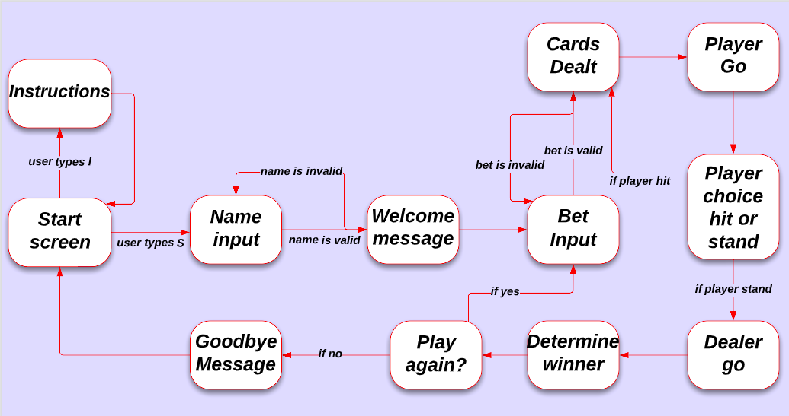
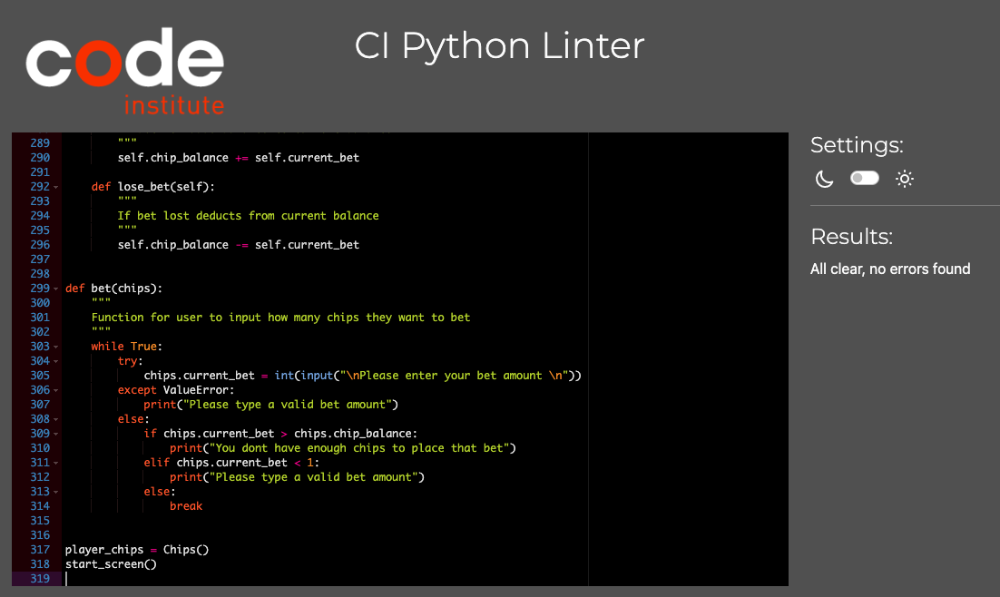

# Python Blackjack

## Overview
A Python terminal game based on the popular card game Blackjack.

Game developed by Sean Johnston for Code Institute Project Portfolio 3 using Python.

[Live Game Link](https://python-blackjack.herokuapp.com/)

## How to play 
This game was designed to be very simple to play and user friendly.
Instructions are given along the way of what key to press to continue the game and the first letter of the input corresponds to the target word(for example S to start game).

The aim of the game is to get as close to 21 as you can without going over it. If you do you will bust and lose the hand. If the dealer gets closer to 21 than you do you will also lose.

At the start of each hand you will be dealt 2 cards. You will then be given the choice whether to hit or stand. If you choose hit you will be dealt another card, if you choose stand it is the dealers turn. The dealer has to hit until they reach 17.

Each card number is worth its value, Jacks, Queens and Kings are worth 10 and Aces are worth both 11 and 1(If you get an Ace and will be over 21 it changes to a 1).

There is also a very simple chip betting system in the game. You will start the game with 500 chips and at the beginning of every hand will be given the choice of how many chips you want to bet. If you win the hand you double the amount of chips you bet and if you lose the hand you lose all the chips you bet. If you run out of chips its game over and the game restarts.

## Project Goals

 This project was created for project 3 of Code Institutes Diploma in full stack web development.

 - ### Main goals of this project include
  
   - Creating a fully functional blackjack terminal game using python.

   - Making the game as realistic as possible for the user

   - Making the game easy to understand for the user while also including game instructions.

 - ### Target audience of the project include 

   - Users that have an interest in card games

   - Users that have an interest in playing simple terminal games for fun.

## User stories

 - As a user I want

   - Clear instructions on how to start the game.
   
   - Instructions on how to play the game

   - An option to play the game again when finished

   - To be able to enter a username

   - Game feedback if I have an incorrect input

## Features

 ### Start screen

 

 The start screen features a "Welcome To Blackjack" ascii text message and a message prompting the user to either press S to start the game or I for the instruction screen.

  - If the user presses the S key they are shown a prompt to enter their username.
  If the username is valid the user is shown a welcome message and the game starts.

 

  - If the user presses the I key they are brought to the instructions page where text is typed out in a typewriter effect and user is given a prompt to enter any key to return to the main menu

  

 ### Bet Input

  

  After the user enters a valid username, they are brought to the bet input screen which asks them how many chips they would like to bet

   - If the user tries to bet more chips than they currently have they are shown an error message telling them they dont have enough chips to place the bet.

   

   - If the user tries to type in a bet amount that is not a number or zero they are shown an error message that asks them to type in a valid bet amount.

   

   - If the user enters a valid bet amount they are shown and ascii message telling them the cards are being dealt before moving on to the next screen.

   

 ### Main Game Screen

   

  After the user enters a valid bet amount the cards are dealt and the user is brought to the main game screen. The user is shown their two cards and total, 1 dealer card and total and are given the option whether to hit or stand.

   - If the user selects hit they are dealt another card and asked to hit or stand again until they bust or choose to stand.

   

   - If the user selects stand it is the dealers turn. The dealers 2 cards and total are now revealed to the player and the dealer takes another card if they are not already on a total of 17.

   

   - After both the player has chosen to stand and the dealer has taken its go the 2 hands are compared and the user is told if they either won or lost the hand. If the user won the hand the text is green and if the user lost the hand the text is red.
   The user is then given an updated chip count and asked if they want to play again.

   

   - If the user selects no on playing again they are brought back to the start screen and their chips reset.

   - If the user selects yes on playing again they are brought back to the bet input screen and their current chip count stays the same.

   

   - If the user runs out of chips they are told that they have run out of chips, shown an ascii text game over message and are brought back to the start screen. Their chips are also reset.

   

   

## Possible Future Features

 Some possible features that could be implemented into the game in the future are

   - Leaderboard betting system

     - While there is currently a chip betting system already in the game I would like to expand on it for game replayability.

   - ASCII card art

     - While there are curently unicode suits for cards I would like to have the cards generated in ASCII art in the future, including different colors to match card suits.

   - Sound effects

     - Card shuffling sound effects is a feature I would eventually like to add to the game.  

## Technologies

 ### Platforms

   - Python was the programming language used to create this project.

   - [Heroku](https://www.heroku.com/) was the platform used to deploy the project.

   - [Github](https://github.com/) and Git were used for version control on the project.

   - Gitpod was the I.D.E used to create the project.

   - [Code Institute](https://www.googleadservices.com/pagead/aclk?sa=L&ai=DChcSEwihmpOZxdT7AhUY7O0KHQfoCQoYABAAGgJkZw&ohost=www.google.com&cid=CAESbOD23lTrQj-qdni7kiJrbFGiE6foYCdCBlBfPjQiteL7YMJQfW4m6Wq768MU5PttgLc80SMqCtz2JIXMrLRwvBZnNHF48SVSK7-f6l2qO2XaL1vj4yBiBt3ZFE9Zd3_sMo8_VpVo0G1C0DeN0A&sig=AOD64_0o-rshCZ_TWMJtTwfpl71-w7W3GA&q&adurl&ved=2ahUKEwiC6ouZxdT7AhUPXMAKHXZJARkQ0Qx6BAgHEAE) template was used on Gitpod for this project.

 ### Python Modules

   - [os](https://docs.python.org/3/library/os.html) was imported to make the clear function to clear the terminal

   - [random](https://docs.python.org/3/library/random.html) was imported for the card shuffle function.

   - [time](https://docs.python.org/3/library/time.html) was imported for the sleep function.

   - [pyfiglet](https://pypi.org/project/pyfiglet/0.7/) was imported for custom ascii messages.

   - [colorama](https://pypi.org/project/colorama/) was imported for custom coloured messages. 

## Flow Chart

 The below flow chart was used in the design of the game and shows how the game loop works from start to finish.

 

## Testing

 ### Validator Testing

  - No errors or warnings were found when putting the code through the CI Python Linter
  
  
 ### Testing User Stories

  - As a user I want clear instructions on how to start the game.

     - The start screen has a very simple layout and only gives the user two clearly labelled options. Either S to start the game or I to read the instructions.

  -  As a user I want Instructions on how to play the game.

     - On the start screen if the user wishes to they can select to view the instructions page which gives a full rundown on how the game works.

  -  As a user I want an option to play the game again when finished.

     - After every hand the user is given the choice to play again by typing Y for yes or N for no. If the user wants to continue on with their current chips they can select yes, otherwise they can select no. 

  - As a user I want to be able to enter a username .

     - At the start of every game the user must enter a username to continue.

  - As a user I want game feedback if I have an incorrect input.

     - The user is given clear instructions in game on every input needed and are unable to continue until they input correctly.

 ### Unit and bug testing

  - All other testing for this project including unit test and bugs are on a seperate file found here ..    

## Deployment

  The following steps were used to deploy this project to [Heroku](https://www.heroku.com/) 

   - Go to Heroku and click on the new button in the top right corner of the page. Then select create new app from the dropdown menu.

   - Choose an app name, select the region and click create app.

   - Go to settings and select Config Vars

   - Add a new Config Var with a key word of PORT and a value of 8000

   - Next in settings find Buildpacks and add Buildpacks Python and NodeJS in that order.

   - Exit settings and click Deploy. Select Github from the deploy options.

   - Find your repository and connect it to Heroku.

   - Select Manual Deploy from the options, make sure main branch is selected and click Deploy Branch.

   - Live version of the app can be found here [Live Game Link](https://python-blackjack.herokuapp.com/)

 

