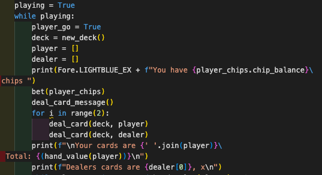
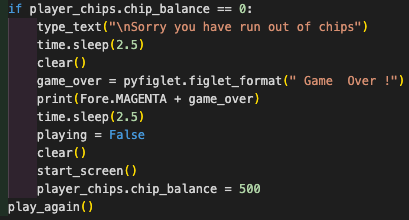
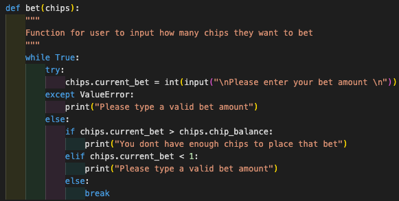
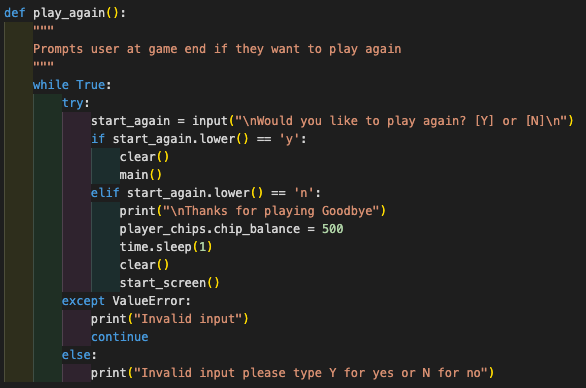

## Function Testing

 Below is a table of every function test, the method of testing and pass or fail.
 If result was fail more info can be found in the fixed bugs section.

 |Function tested | Method of testing  | Result  |   
|---|---|---|
| new_deck()   | Created test decks to make sure cards were being added accordingly and shuffled.  | Pass  |   
| deal_card()  | Created test hand variable to make sure cards were beng taken from deck accordingly. Checked length of deck was getting smaller as cards were being taken  | Pass  |   
| hand_value()  | Created test list variables to make sure hand values matched up accordingly.  | Fail (see fixed bugs section.)  | 
|check_winner()| Created test player and dealer hands and passed them as arguments into check winner function | Pass |
| start_screen() | Checked both inputs are validated correcty and worked accordingly | Pass |
| name_input() | Checked user could only type in letters for username. | Fail (see fixed bugs section.) |
| instructions() | Checked all printed text lined up correctly and was not distorted. | Fail (see fixed bugs section.) |
| main() | Went through start screen process and played through a few main game loops to make sure main game loop was functioning correctly. | Fail (see fixed bugs section.) |
| bet() using Chips class | Played through a few main game loops and made sure chips were being taken and added to player chip stack accordingly. | Fail (see fixed bugs section) |
| play_again() | Played through main game loops to make sure user  input validation was working correctly, if user pressed yes a new deck was created and the user kept current chip stack. If user selected no chip stack was reset. | Fail (see fixed bugs section.) |
| clear() | Checked that screen was being cleared anytime function was called | Pass |

## Fixed bugs

 Below is a description of fixed bugs from unit test fails.

 ### hand_value()

  - #### Reason for fail:

    - When testing hand values I noticed that the value of Aces were not changing accordingly to 1 instead of 11.

  - #### Fix:

    - After some testing I concluded the problem was because of the way I had written my hand value function. I originally had the function set up to check if the string value "A" was in hand and hand value was > 10 change the value to 1. I changed the function to keep track of aces then made a while loop to state while number of aces is > 0 and value is < 21 take 10 away from hand total. See below code snippet for function solution.
    
   

  ### name_input()

  - #### Reason for fail:

    - When testing the name input I noticed that the user could type in any character other than letters including directional buttons and the input would be validated, even though I had set up my code to prevent this.

  - #### Fix:

    - After some more testing and research I concluded that I need to add the .strip() method at the end of my name input to get rid of any whitespace, I also need to add the .isalpha() method to make sure any input was a letter. See below code snippet for function solution.

      

  ### instructions()

  - #### Reason for fail:

    - When testing my instruction screen text I noticed that the text was not lining up correctly when deployed on Heroku.

  - #### Fix:

    - After some more testing and research I concluded that the new line method I was using was incorrect. I had been using \ (backslashes) to enter a new line of text but I found if i simply used inverted commas and lined up the text in a block along with \n, the text would line up as I wanted. See below code snippet for function solution.

    

  ### main()

  - #### Reason for fail:

    - While testing the main game loop the main bug I encountered was the game loop breaking each time the player and dealer had both had their go. 

  - #### Fix:

    - I originally had the main game function set up into 2 loops, the player go loop and the dealer go loop but after some more testing and research the solution i found was to put the whole game loop into a while loop and break the loop only if the player runs out of chips or chooses no in the play_again() function. See below code snippets for solution. 

    
   

  ### bet()

  - #### Reason for fail:

    - When testing the bet function I encountered two bugs. The first bug was that the user could enter a minus bet amount and could essentially gain infinite chips. The second bug is the user could enter a bigger bet amount than their current stack which would cause the game to crash.

  - #### Fix:

    - These bugs did not take long to fix, I quickly discovered I simply had not accounted for different type of game loop scenarios in the function and added in the appropriate code to fix. See below code snippet for solution.

       

  ### play_again()

  - #### Reason for fail:

    - When testing the play again function I discovered if the user selected no on playing again, even though they were brought back to the start screen their chip stack was not resetting to the default 500 chips.

  - #### Fix:

    - To fix this bug I simply put in the code to make the player chip stack = 500 chips again if the user selected no on the input. See below code snippet for solution.

    

## Unsolved bugs

### There are no known unsolved bugs